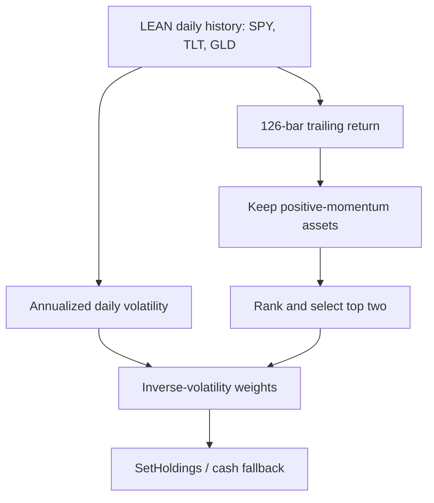

# Defensive Cross-Asset Momentum

**A C# strategy for QuantConnect LEAN that applies absolute and relative momentum to SPY, TLT, and GLD, then sizes selected assets by inverse volatility.**

[Published QuantConnect strategy](https://www.quantconnect.com/strategies/732/Defensive-Cross-Asset-Momentum) · [Algorithm source](Main.cs)

> **Research status:** Historical backtest only. This repository does not contain a live-trading deployment, an independent data pipeline, or out-of-sample validation.

## 1. Purpose

The strategy tests whether a small cross-asset universe can retain exposure to positive trends while moving away from assets with negative six-month momentum.

| Symbol | Exposure | Role in the universe |
| --- | --- | --- |
| SPY | US equities | Growth/risk asset |
| TLT | Long-duration US Treasuries | Defensive duration exposure |
| GLD | Gold | Alternative defensive exposure |

## 2. Backtest demonstration

The algorithm writes its selected assets and trailing momentum to the LEAN log at each rebalance:

```text
YYYY-MM-DD: SPY momentum=<measured value>, GLD momentum=<measured value>
```

This is the log format emitted by `Main.cs`, not a stored result. Run the algorithm using the instructions below to generate actual selections for the current LEAN data snapshot.

A previously published QuantConnect run reported the following summary for 25 May 2021–25 May 2026:

| Metric | Reported value |
| --- | ---: |
| Starting capital | $100,000 |
| Ending portfolio value | $182,624.96 |
| Net return | 82.63% |
| Compounding annual return | 12.81% |
| Maximum drawdown | 17.10% |
| Sharpe ratio | 0.487 |
| Sortino ratio | 0.548 |
| Completed trades | 111 |
| Total fees | $154.82 |

These values are retained as a reported platform snapshot. A machine-readable QuantConnect result export is not currently committed, so they should not be treated as independently verified repository outputs.

## 3. Architecture



The entire strategy is contained in [`Main.cs`](Main.cs) and executes inside the QuantConnect LEAN engine.

## 4. Setup and run

### Fastest route: QuantConnect Cloud

1. Create a new C# project in the QuantConnect web IDE.
2. Replace the generated `Main.cs` with this repository's [`Main.cs`](Main.cs).
3. Build the project.
4. Run a backtest. The dates and starting capital are set in code.
5. Export the statistics, equity curve, trade list, orders, and logs from the result page.

### LEAN CLI route

Local CLI use requires Docker, the LEAN CLI, access to the required US Equity data, and an eligible QuantConnect organization.

```bash
pip install lean
lean login
lean init
lean project-create "Defensive Cross-Asset Momentum" --language csharp
cp Main.cs "Defensive Cross-Asset Momentum/Main.cs"
lean backtest "Defensive Cross-Asset Momentum"
```

The CLI stores the full run output under the project's `backtests/` directory. Data availability and licensing determine whether the historical run can be reproduced locally.

## 5. Methodology

The algorithm runs after a 126-daily-bar warm-up and schedules rebalancing at both month start and month end.

For each asset (i):

1. Compute trailing momentum from the first and last close in the 126-bar history:

   $$
   M_i = \frac{P_{i,t}}{P_{i,t-126}} - 1
   $$

2. Compute sample standard deviation of daily returns and annualize it:

   $$
   \sigma_i = \operatorname{stdev}(r_{i,1}, \ldots, r_{i,n})\sqrt{252}
   $$

3. Remove assets where (M_i \le 0) or volatility is zero.
4. Rank remaining assets by momentum and retain at most two.
5. Assign inverse-volatility weights:

   $$
   w_i = \frac{1/\sigma_i}{\sum_{j \in S}1/\sigma_j}
   $$

6. Liquidate assets that leave the selected set. If no asset qualifies, liquidate the portfolio and remain in cash.

The code uses daily `TradeBar` history, LEAN's scheduled events, default security models, `SetHoldings` for target weights, and SPY as the benchmark.

## 6. Reproducible results

The reproducible unit in this repository is the algorithm definition and its fixed configuration:

| Parameter | Value in `Main.cs` |
| --- | --- |
| Backtest window | 25 May 2021–25 May 2026 |
| Starting capital | $100,000 |
| Universe | SPY, TLT, GLD |
| Resolution | Daily |
| Lookback | 126 daily bars |
| Maximum holdings | 2 |
| Rebalance schedule | Month start and month end at 08:00 |
| Benchmark | SPY |

To make the performance results independently auditable, rerun the strategy and commit the exported result JSON, order list, trade list, equity curve, LEAN version, and data normalization settings. Until that artifact exists, the published summary table above is a reported result rather than a fully reproducible one.

## 7. Testing

This repository currently has no separate unit-test project. Validation therefore occurs through a LEAN build and backtest:

```bash
lean backtest "Defensive Cross-Asset Momentum"
```

Minimum checks for a fresh result:

- The algorithm builds without errors and completes the configured date range.
- Portfolio exposure never exceeds the normalized selected-asset weights.
- Assets with non-positive measured momentum are not newly selected.
- No more than two assets are held after a rebalance.
- The portfolio is in cash when every asset fails the absolute-momentum filter.
- Rebalance logs, orders, holdings, and fee totals reconcile with the exported result.

## 8. Limitations and unfinished work

- The five-year period is in-sample; no train/validation split or walk-forward test is included.
- Only three US-listed ETFs are considered, creating concentration and regime dependence.
- The code requests 126 bars, which is close to six months but not a fixed calendar-month definition.
- Rebalancing twice per month can increase turnover; no turnover constraint is implemented.
- Fee, fill, slippage, leverage, and data-normalization behavior relies on the active LEAN defaults unless configured externally.
- No parameter-sensitivity analysis, bootstrap analysis, or statistical significance test is included.
- No comparison artifact against SPY or a balanced benchmark is stored in this repository.
- Taxes, bid-ask spreads, market impact, liquidity constraints, and account-specific restrictions are not modeled explicitly in `Main.cs`.
- No automated tests, CI workflow, result JSON, trade export, or equity-curve image is committed yet.
- Historical performance does not establish a live trading edge and does not guarantee future results.

## Repository structure

```text
Main.cs    QuantConnect LEAN algorithm
README.md  Strategy definition, reproduction steps and validation boundary
```

## Disclaimer

For educational and research use only. Nothing in this repository constitutes investment advice.
